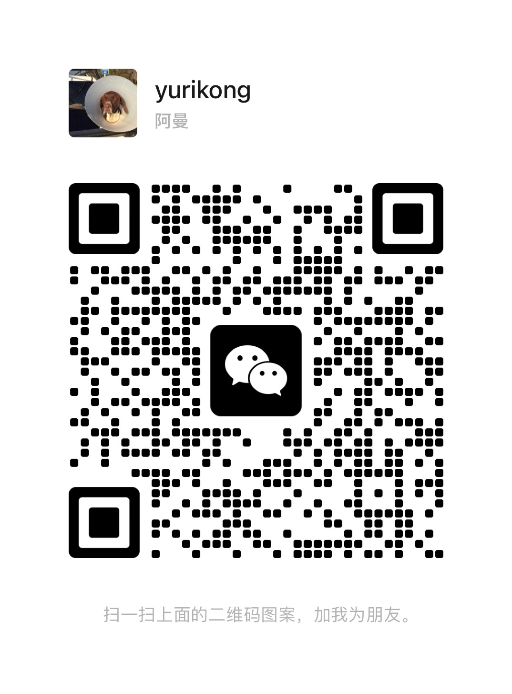
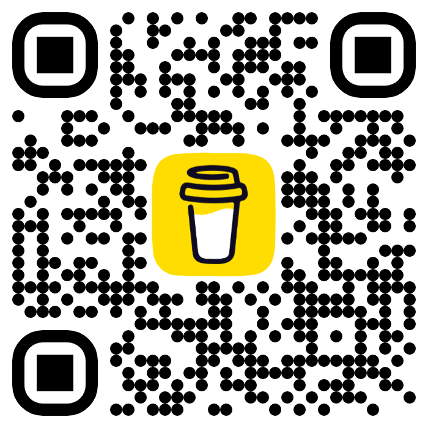

## Hi there 👋

- 🔭 I’m currently working on a minimalist resume template using Astro, and soon will work on other personal projects. I plan to open-source all my personal projects.
- 🌱 I’m currently learning how to make a good latte.
- 👯 I’m looking to collaborate on interesting and fun projects. Hit me up!
- 🤔 I’m looking for help with kickstarting my freelancing career.
- 💬 Ask me about making softwares! I am open to opportunities, whether if it's building from ground up, or adding features, or maintenance. Hit me up and let's talk about it!
- 😄 Pronouns: he/him
- ⚡ Fun facts:

  - I lived in California for 8 straight years.
  - I can speak English, Cantonese, and Mandarin.
  - I want to be a digital nomad.

## Contact me 📫:

- <a href="mailto:jackdu2013@163.com" title="jackdu2013@163.com">Email</a>
- Wechat

  

## Support me 💰:

- Wechat

  

- Buy me a coffee

  
